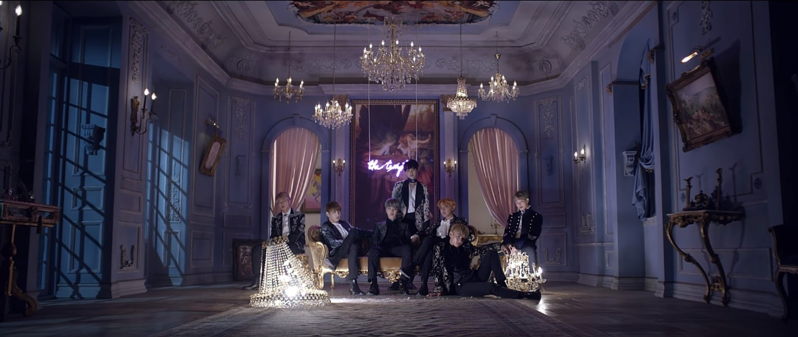
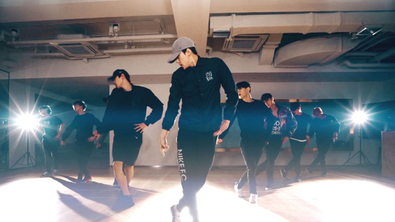

K-pop za roky své existence do sebe vstřebal plno různých žánrů: elementy taneční hudby, elektropopu, hip hopu a současného r'n'b. Je to směs módní západní populární hudby a vysokoenergetického japonského popu, která loví hlavy posluchačů pomocí chytlavých opakovaných fragmentů, občas v anglickém jazyce. K-pop zahrnuje fúzi stylů jak se zpěvem tak i s rapem a klade zvláštní důraz na představení a silné vizuální efekty.

Tento styl je především známý pro své propracované hudební videoklipy kde se klade důraz na estetiku, mnohdy velmi komplexní a složité choreografie a ucelený děj.

## Písně
K-pop není samostatný žánr, je to kultura, potažmo subkultura, která v sobě zahrnuje přes 100 růžných žánrů od klasického popu, přes již zmiňovaný hip hop a r'n'b, až po rock a metal. Většina písní má velmi chytlavé melodie a díky částem, které jsou zpívané anglicky jsou více dostupné i pro širší veřejnost, která korejsky zrovna mluvit neumí.
Co se témat písní týče, tak je K-pop taktéž rozmanitý. Jako v západních zemích tu převládá téma lásky v různých podobách. Dalšími oblíbenými tématy jsou ale i mládí a problémy v dospívání. V současnosti nejpopulárnější skupina **BTS** se například proslavila písněmi, kde zpívají o vážných problémech ve společnosti. Plno zpěváků se také často podílí na tvorbě hudby a textu. Je celkem běžné, že rapeři si svoji část rapu píší sami.

## Zpěváci
K-pop má mnoho samostatných sólových zpěváků i raperů, jak žen, tak i mužů. Existují ale i sóloví zpěváci, kteří jsou členy některých větších skupin, jako například **Taemin** z chlapecké skupiny **SHINee** nebo **Taeyeon** z dívčí skupiny **Girl's Generation**.
Dále tu máme dua jako například **TVXQ**, tria (většinou tři členové z větší skupiny, působící jako podskupina - např. **EXO-CBX**), a tak dále... Nejužívanější počet členů v jedné skupině je ale pět členů (**BIGBANG**, **Red Velvet**) nebo sedm členů (**BTS**, **GOT7**). Najdou se i skupiny, které mají členů víc:
+ **EXO** - 9 členů
+ **Seventeen** - 13 členů
+ **NCT** - 21 členů (ve čtyřech podskupinách)

Kromě hudebních skupin existují i kapely, nejznámější z nich jsou **FT Island**, **CN Blue** a **DAY6**.
Toto vše byl pouze seznam pouze chlapeckých, či pouze dívčích skupin, máme zde ale i smíšené skupiny, i když jich není mnoho, mezi nejznámější patři **K.A.R.D** a **Akdong Musician**.
Každý ze členů skupiny má určitou pozici a postavení, které zastupuje: 
*leader* - vůdce celé skupiny, nejčastěji nejstarší nebo nejvíce zkušený člen 
*main vocal* - hlavní zpěvák, zpívá hlavní melodii a jde v písni slyšet nejvíce 
*sub vocal* - vedlejší zpěvák, podpora hlavního zpěváka, většinou zpívá druhý hlas 
*raper* - má na starosti rap 
*dancer* - tanečník, který většinou vede choreografii 
*visual* - člen, který je nejvíce atraktivní, většinou stojí v popředí 
*face of the group* - tvář celé skupiny, většinou nejznámější člen 
*maknae* - nejmladší člen skupiny

Jednu určitou pozici ve skupině může zastávat více lidí najednou a také naopak jeden člen může zastávat ve skupině více rolí.

## Hudební videoklipy
Videoklipy se snaží diváky zaujmou co nejvíce to jde, jsou velmi kvalitně natočené s bohatými kulisami, množstvím různých scén, mají velkou estetickou hodnotu a dokážou představit propracovaný děj.
Natáčí se jak v interiéru tak exteriéru. Máme tu roztomilé koncepty, které jsou většinou vyvedeny ve velmi pestrých barvách a jsou živé a veselé a naopak dark koncepty, kde převládají temné barvy, některé z nich jsou děsivé, jiné smutné. Další koncepty mohou vypadat jako romantická komedie, akční film nebo jsou tu i koncepty šílené, které nedávají smysl.
Součástí tohoto všeho jsou i kostýmy pro zpěváky. Najdete zde vše od stylových obleků a krásných večerních šatů až po otrhané džíny, vytahaná trička a extravagantní oblečky.
Další, a asi nejvíce opovrhovanou součástí K-popu, je make-up a šperky. Při natáčení videoklipů a při vystupování jsou nalýčené nejen ženy, ale i muži, což bývá pro většinu lidí ze Západu největší problém přijmout. V Koreji, ale i v jiných asijských zemí je také běžné, že si muži nechávají propíchnout uši a nosí náušnice, a to více než ženy, což také nebývá přijímáno kladně. V jejich zemi je to ovšem standard.

## Tanec
Téměř každá píseň má zde svou vlastní choreografii. Čím více členů skupina má, tím zajímavější choreografie je. Části tance se oběvují ve videoklipech a celá choreografie pak bývá představena na vystoupeních a poté, buď ve formě taneční verze videoklipu nebo záznamu ze zkoušky, bývá sdílena na Youtube. V K-popu téměř neexistuje jednoduchá choreografie, většinou se jedná o těžké, komplexní tance, kde je každý pohyb vypočítaný a skupiny trénují každý den po dobu několika měsíců, aby tyto tance členové zvládli naprosto bezchybně.
Každá choreografie má také takzvaný *point dance*. To je část chorea nebo pohyb, který reprezentuje celou píseň a je pro fanoušky také nejvíce zapamatovatelný.
Velké množství skupin si najímá profesionální choreografy, aby jim pomohli s vytvořením choreografií, ale v některých skupinách jsou členové, kteří se tvorby tance ujímají sami.

Výsledkem tohoto všeho jsou velmi dobře promyšlené hudební videoklipy a smysluplné písně, které někdy vedou člověka k zamyšlení a někdy v něm vyvolají velké emoce.